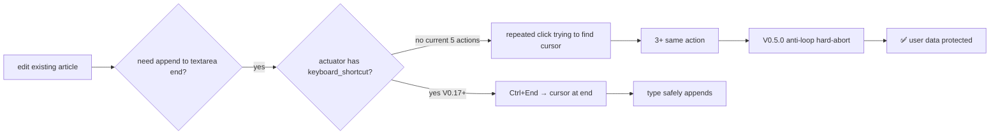
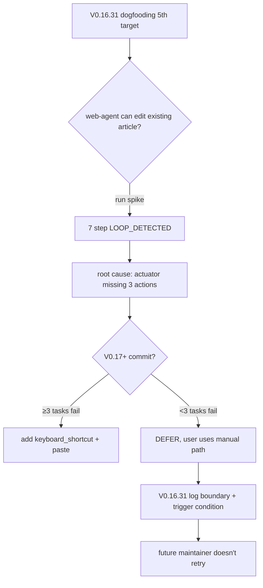

# Build Time vs Edit Time — My Web Agent Can Publish But Can't Edit (An Honest Capability-Boundary Spike)

*V0.16.31 dogfooding spike NO-GO + V0.17+ actuator TODO · 2026-05 · ~6 min read · [English / 中文](2026-05-build-vs-edit-time-final.md) · by [@franciseliang99-dot](https://github.com/franciseliang99-dot)*


> **TL;DR**: My [web-agent](https://github.com/franciseliang99-dot/web-agent) used itself to publish 2 blog posts to dev.to (full dogfooding story). But when I asked it to edit the already-published blog 1 to add a cross-link, it ran 7 steps before V0.5.0 anti-loop hard-aborted — exposing a capability boundary: actuator's 5 actions (click/type/scroll/extract/done) lack `keyboard_shortcut` / `paste` / textarea range API. **Failure itself is data**: edit existing article isn't web-agent's current sweet spot. This post is about "honestly logging failure" and the V0.17+ fix path.

---

## 0. Background: 5th task after 4 successful dogfoodings

My [web-agent](https://github.com/franciseliang99-dot/web-agent) used itself to run 4 real-account E2E tasks:

| Version | Platform | Task | Result |
|---|---|---|---|
| V0.16.17 | Gmail | compose + send | ✅ email reached inbox |
| V0.16.27 Chinese | dev.to | save draft (proactively avoided Publish) | ✅ 9 step / 2.5 min |
| V0.16.27 English | dev.to | save draft (proactively avoided Publish) | ✅ 9 step / 3.4 min |
| V0.16.30 | dev.to | **publish public** (proactively clicked Publish) | ✅ 9 step / 3.4 min |

V0.16.27 + V0.16.30 bidirectional contrast is especially important: same web-agent + same LLM (Claude Sonnet 4.6 vision), different goal constraint → opposite behavior (avoid Publish vs proactively click Publish). Proves W3-A safety is **controlled by env + goal**, not hardcoded.

5th task: have web-agent edit the already-published blog 1, append a cross-link to blog 2 (mutual referral).

— And it failed.

## 1. V0.16.31: 7-step LOOP_DETECTED hard-abort

| step | action | result |
|---|---|---|
| 0 | click [13] Edit | ✅ entered edit mode |
| 1 | click [31] body textarea | ✅ focused |
| 2-6 | **repeated click [31]** trying to position cursor at end | ❌ 5 same-action attempts failed |
| 7 | V0.5.0 anti-loop hard-abort | Protected user's data integrity |

LLM thought self-reported (step 5):
> Tool limitation (no keyboard shortcut like Ctrl+End), I need to try another strategy. But the current toolkit has no direct keyboard shortcut function.

The LLM **was aware of the capability boundary**, but repeated clicking the same mark triggered V0.5.0 anti-loop (3+ same-action hard-abort). **Anti-loop firing = positive signal** — without it, the LLM might blindly type the full 5KB content overwriting the original article (disaster).

## 2. Root cause: 5 actions in actuator aren't enough

My web-agent actuator currently has 5 actions (V0.16.0+ stable):

```python
type ActionType = "click" | "type" | "scroll" | "extract" | "done"
```

Missing:
- `keyboard_shortcut` — standard way to jump to textarea end (`Ctrl+End`)
- `paste` — bypass human-like typing, inject content directly (clipboard injection)
- `textarea_set_value` — direct DOM API setter (`textarea.value = newContent`)



## 3. Why actuator has stayed at 5 actions

V0.16.0's design choice: **keep actuator interface narrow, let LLM compose for complex effects**. Reasoning:
- More tools in LLM tool schema = longer prompt = higher token cost
- Human-like click + type + scroll already covers **most form-filling** tasks (W1-W3 all passed)
- Complex keyboard shortcuts are anti-detection grey zone (real users rarely use Ctrl+End — likely flagged by anti-bot ML)

**But**: edit existing article needs "safely append to long text", which is **precise cursor positioning**. 5 actions just isn't enough. The composed approach (click → scroll → click end position) is also unreliable in React SPA textareas (cursor can be reset by React).

## 4. V0.17+ fix path (with trigger conditions, not yet committed)

If we want to support edit-existing-article tasks in the future, actuator needs to expand to 7 actions:

```python
# V0.17 proposal (only if triggered)
type ActionType = (
    "click" | "type" | "scroll" | "extract" | "done"
    | "keyboard_shortcut"  # args={"key": "End", "modifiers": ["Control"]}
    | "paste"              # args={"text": "..."}
)
```

Implementation:
- `keyboard_shortcut`: `page.keyboard.press("Control+End")` direct Playwright keyboard API
- `paste`: two implementations (`page.evaluate` setter or clipboard + Ctrl+V), the latter is more human-like but clipboard permissions are tricky

Effort ~6-10h (5 → 7 actions expansion + safety rule integration + LLM tool schema description updates + tests).

**Trigger conditions (any one fires)**:
1. User feedback citing ≥3 real tasks failing due to missing keyboard shortcut (V0.16.31 is the 1st)
2. Anti-detection layer upgrade requires paste-from-clipboard to mimic human behavior
3. Spike proves paste action is ≥3× faster than human-like typing without triggering anti-detection

Don't commit until trigger condition fires — V0.17 priority is the Action discriminated union refactor (V0.16.12 logged tech debt).

## 5. This is a spike-and-decide victory, not a failure



**Failure itself is spike data**:
- Not a "magic tool that does anything" — has clear capability boundary
- LOOP_DETECTED empirically validates V0.5.0 anti-loop design intent (LLM may blindly retry, safety net is mandatory)
- Logging + trigger condition = future maintainer doesn't think it's a bug or repeat the attempt

This follows the same pattern as my [patchright NO-GO story](https://dev.to/francise_liang_e4544eadb9/why-i-permanently-no-god-patchright-after-a-spike-and-the-anti-detection-decision-tree-3m11) — **run spike → take data → log it**, more responsible than pretending it works or blindly implementing.

## 6. Lessons

1. **Dogfooding isn't a marketing gimmick**. 4/5 = 80% success rate is more credible than 100% — real-account E2E always exposes boundaries. My 5-action actuator is enough for W1-W3 (form fill), insufficient for edit-existing. Honestly logging > pretending omnipotent.

2. **Anti-loop is a mandatory safety net**. V0.5.0 design (3+ same-action hard-abort) finally fired in V0.16.31 — without it, LLM might blindly type 5KB overwriting original article. The LLM "self-aware of capability boundary" doesn't necessarily stop it from continuing to retry — anti-loop is the last line of defense.

3. **Logging capability boundaries is more urgent than capability expansion**. I could spend 6-10h adding keyboard_shortcut + paste to fix this failure, but the **trigger condition requires ≥3 tasks to fail before committing** — don't make architectural changes for a single user use-case. Writing "already-disproved" paths into ARCHITECTURE/CHANGELOG so a future maintainer reads in 1 minute saves them 1 hour of re-running the spike.

4. **5 → 7 actions is a potential V0.17+ major change**, not V0.16.31's emergency fix. Once you expand actions, LLM tool schema + safety rules + human-like-ness + anti-detection all need re-evaluation. **Conservative interface expansion** = long-term project hygiene.

## 7. Data + code (open source MIT)

Full 5-time dogfooding record + capability boundary + V0.17+ TODO on GitHub:

- 📊 [`CHANGELOG.md V0.16.31`](https://github.com/franciseliang99-dot/web-agent/blob/main/CHANGELOG.md) — V0.16.31 spike full execution trace + 4/5 success rate cumulative table
- 📖 [`docs/ARCHITECTURE.md`](https://github.com/franciseliang99-dot/web-agent/blob/main/docs/ARCHITECTURE.md) — project decision tree + actuator 5 actions choice
- 🔧 [`src/web_agent/actuator.py`](https://github.com/franciseliang99-dot/web-agent/blob/main/src/web_agent/actuator.py) — current 5 actions (V0.17+ 7 actions expansion entry point)
- 🛡 [`src/web_agent/loop.py`](https://github.com/franciseliang99-dot/web-agent/blob/main/src/web_agent/loop.py) — V0.5.0 anti-loop hard-abort (3+ same-action detection)

```bash
# Reproduce V0.16.31 dogfooding spike (requires ANTHROPIC_API_KEY + Chrome + dev.to login state)
git clone https://github.com/franciseliang99-dot/web-agent && cd web-agent
uv sync && uv run playwright install chromium
cp .env.example .env  # add ANTHROPIC_API_KEY

# Run (will trigger LOOP_DETECTED, this is expected)
WEB_AGENT_AUTO_APPROVE='*' uv run web-agent "edit your already-published dev.to article appending a section..." \
  --url "https://dev.to/.../your-article" \
  --max-steps 25 --max-wallclock-s 600
```

## Project: web-agent

> MultiOn-style high-fidelity Web Agent. Python + Playwright + VLM/SoM + stealth, BYO LLM (Anthropic/OpenAI/Kimi).

- ⭐ **github.com/franciseliang99-dot/web-agent** — MIT License
- 📋 80+ commits, 255 tests passed, mypy strict 0, GitHub Actions CI all green
- 📝 Blog series (this is post 3):
  1. [50% Compliance, Not 0%](https://dev.to/francise_liang_e4544eadb9/50-compliance-not-0-how-a-logging-spike-almost-triggered-the-wrong-architecture-rewrite-1lna) — W5-C.2 spike regex false-negative
  2. [Why I Permanently NO-GO'd Patchright](https://dev.to/francise_liang_e4544eadb9/why-i-permanently-no-god-patchright-after-a-spike-and-the-anti-detection-decision-tree-3m11) — anti-detection decision tree
  3. **(this post)** Build Time vs Edit Time — capability-boundary spike

If you're also working on a web automation / web agent project, this failure case might save you 6-10h of actuator interface expansion — at least until you have ≥3 real tasks failing.

**Comments welcome**: how many actions does your web automation actuator/action API have? Which actions did you "actually use" vs "thought you'd use but didn't"?

---

*Repost requires source attribution + repo link.*
