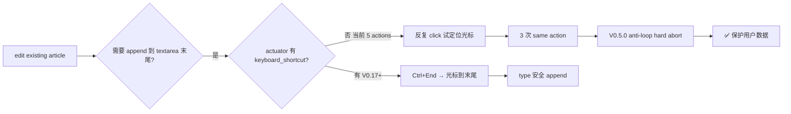
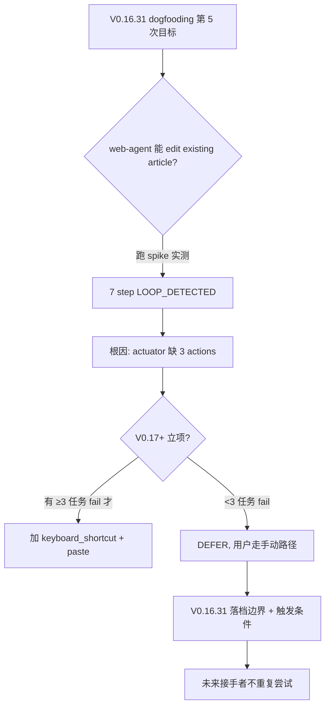

# Build Time vs Edit Time — 我的 Web Agent 能 publish 但还不能 edit (一次诚实的能力边界 spike)

*V0.16.31 dogfooding spike NO-GO + V0.17+ actuator TODO · 2026-05 · 阅读约 6 分钟 · 中文 / [English](2026-05-build-vs-edit-time-final-en.md) · 作者: [@franciseliang99-dot](https://github.com/franciseliang99-dot)*


> **TL;DR**: 我的 [web-agent](https://github.com/franciseliang99-dot/web-agent) 用自己 publish 了 2 篇博客到 dev.to (dogfooding 故事完整). 但当我让它去 edit 已发布的博客 1 加一个 cross-link 时, 跑 7 step 后 V0.5.0 anti-loop 硬 abort — 暴露能力边界: actuator 5 actions (click/type/scroll/extract/done) 缺 keyboard_shortcut / paste / textarea range API. **失败本身是数据**: edit existing article 不是 web-agent 当前架构的 sweet spot。这篇是关于"诚实落档失败"和 V0.17+ 修复路径的故事。

---

## 0. 背景: dogfooding 4 次成功后的第 5 次

我的 [web-agent](https://github.com/franciseliang99-dot/web-agent) 用自己跑过 4 次真账号 E2E 任务:

| 版本 | 平台 | 任务 | 结果 |
|---|---|---|---|
| V0.16.17 | Gmail | compose + send | ✅ 邮件真发到 inbox |
| V0.16.27 中文 | dev.to | save draft (主动避开 Publish) | ✅ 9 step / 2.5 min |
| V0.16.27 英文 | dev.to | save draft (主动避开 Publish) | ✅ 9 step / 3.4 min |
| V0.16.30 | dev.to | **publish 公开** (主动 click Publish) | ✅ 9 step / 3.4 min |

V0.16.27 + V0.16.30 双向对照特别重要: 同一 web-agent + 同一 LLM (Claude Sonnet 4.6 vision), 不同 goal 约束 → 反向行为 (避开 Publish vs 主动 click Publish)。证明 W3-A safety **由 env + goal 控制**, 不是 hardcoded。

第 5 次任务: 让 web-agent 编辑已 publish 的博客 1, 在末尾追加 cross-link 到博客 2 (互引流)。

——这次失败了。

## 1. V0.16.31: 7 step LOOP_DETECTED 硬 abort

| step | action | 结果 |
|---|---|---|
| 0 | click [13] Edit | ✅ 进入编辑模式 |
| 1 | click [31] body textarea | ✅ 聚焦 |
| 2-6 | **反复 click [31]** 试图定位光标到末尾 | ❌ 5 次相同 action 失败 |
| 7 | V0.5.0 anti-loop 硬 abort | 保护用户数据完整性 |

LLM thought 自述 (step 5):
> 工具限制（无键盘快捷键如 Ctrl+End），我需要尝试另一种策略。但当前工具没有直接发送键盘快捷键的功能。

LLM **意识到能力边界**, 但反复 click 同一 mark 触发 V0.5.0 anti-loop (3+ 次同 action 硬 abort)。**Anti-loop 起作用 = 正面信号** — 没有它, LLM 可能盲目 type 全文 5KB 覆盖原文章 (灾难).

## 2. 根因: actuator 5 actions 不够

我的 web-agent actuator 当前 5 actions (V0.16.0+ stable):

```python
type ActionType = "click" | "type" | "scroll" | "extract" | "done"
```

不含:
- `keyboard_shortcut` — 跳到 textarea 末尾的标准方法 (`Ctrl+End`)
- `paste` — 绕过拟人键入直接灌内容 (clipboard injection)
- `textarea_set_value` — 直接 DOM API 设值 (`textarea.value = newContent`)



## 3. 为什么 actuator 一直只有 5 actions

V0.16.0 之前的设计选择: **保持 actuator 接口窄, 让 LLM 用组合达到复杂效果**。理由:
- LLM tool schema 越多, prompt 越长, token 越贵
- 拟人 click + type + scroll 已能覆盖**绝大多数表单填写**任务 (W1-W3 都通过)
- 复杂 keyboard shortcut 是反检测灰区 (真人很少用 Ctrl+End, 大概率反爬识别)

**但**: edit existing article 需要的是"在长文本末尾安全 append", 这种**精确光标定位** scenario 5 actions 实在不够。组合方案 (click → scroll → click 末尾位置) 在 React SPA textarea 里也不可靠 (光标位置可能被 React 重置)。

## 4. V0.17+ 修复路径 (有触发条件, 不立项)

如果未来真要支持 edit existing article 类任务, actuator 需要扩 7 actions:

```python
# V0.17 提议 (有触发才做)
type ActionType = (
    "click" | "type" | "scroll" | "extract" | "done"
    | "keyboard_shortcut"  # args={"key": "End", "modifiers": ["Control"]}
    | "paste"              # args={"text": "..."}
)
```

实现:
- `keyboard_shortcut`: `page.keyboard.press("Control+End")` 直接调 Playwright keyboard API
- `paste`: 两种实现 (`page.evaluate` setter 或 clipboard + Ctrl+V), 后者更接近真人但 clipboard 权限难处理

工时 ~6-10h (含 5 → 7 actions 扩 + safety 规则集成 + LLM tool schema 描述更新 + tests)。

**触发条件 (任一满足才立项)**:
1. 用户反馈 ≥3 个真实任务因 actuator 缺 keyboard shortcut 失败 (V0.16.31 是第 1 个)
2. 反检测层升级需 paste-from-clipboard 模拟人行为
3. spike 证 paste action 比拟人键入快 ≥3× 且不触发反检测

不到立项触发不做 — V0.17 优先做 Action discriminated union 重构 (V0.16.12 标的技术债)。

## 5. 这是 spike-and-decide 风格的胜利, 不是失败



**失败本身是 spike 数据**:
- 不是"什么都能跑"的魔术工具, 有明确能力边界
- LOOP_DETECTED 实证 V0.5.0 anti-loop 设计意图 (LLM 可能盲目 retry, 必须 safety net)
- 落档 + 触发条件 = 后人接手不会以为是 bug 或反复尝试

这跟我的 [patchright NO-GO 故事](https://dev.to/francise_liang_e4544eadb9/why-i-permanently-no-god-patchright-after-a-spike-and-the-anti-detection-decision-tree-3m11) 同模式 — **跑 spike → 拿数据 → 落档**, 比假装能跑或盲目实施更负责。

## 6. 教训

1. **dogfooding 不是 marketing 噱头**。4/5 = 80% 成功率比 100% 更可信 — 真账号 E2E 总会暴露边界。我的 5 actions actuator 在 W1-W3 (form fill) 够用, 在 edit-existing 不够。诚实落档比假装全能更好。

2. **anti-loop 是必需 safety net**。V0.5.0 设计 (3+ 次同 action 硬 abort) 在 V0.16.31 终于实证起作用 — 没有它, LLM 可能盲目 type 5KB 覆盖原文。LLM 的"自我意识到能力边界"不一定能阻止它继续尝试, anti-loop 是最后防线。

3. **能力边界落档比能力扩张更紧迫**。我可以花 6-10h 加 keyboard_shortcut + paste 解决这个失败, 但**触发条件要求 ≥3 任务 fail 才立项** — 不要为单个用户用例做架构改动。把"已证伪"路径写进 ARCHITECTURE/CHANGELOG, 后人接手 1 分钟读完, 比再跑 spike 节省 1 小时。

4. **5 → 7 actions 是 V0.17+ 的潜在大动作**, 不是 V0.16.31 的紧急修复。一旦扩 actions, LLM tool schema + safety 规则 + 拟人感 + 反检测都要重新评估。**保守扩接口** = 长期项目卫生。

## 7. 数据 + 代码 (开源 MIT)

完整 dogfooding 5 次记录 + 能力边界 + V0.17+ TODO 在 GitHub:

- 📊 [`CHANGELOG.md V0.16.31`](https://github.com/franciseliang99-dot/web-agent/blob/main/CHANGELOG.md) — V0.16.31 spike 详细执行轨迹 + 4/5 成功率累积表
- 📖 [`docs/ARCHITECTURE.md`](https://github.com/franciseliang99-dot/web-agent/blob/main/docs/ARCHITECTURE.md) — 项目决策树 + actuator 5 actions 选择
- 🔧 [`src/web_agent/actuator.py`](https://github.com/franciseliang99-dot/web-agent/blob/main/src/web_agent/actuator.py) — 当前 5 actions 实现 (V0.17+ 扩 7 actions 入口)
- 🛡 [`src/web_agent/loop.py`](https://github.com/franciseliang99-dot/web-agent/blob/main/src/web_agent/loop.py) — V0.5.0 anti-loop 硬 abort (3+ 次同 action 检测)

```bash
# 复现 V0.16.31 dogfooding spike (要 ANTHROPIC_API_KEY + Chrome + dev.to 已登录态)
git clone https://github.com/franciseliang99-dot/web-agent && cd web-agent
uv sync && uv run playwright install chromium
cp .env.example .env  # 填 ANTHROPIC_API_KEY

# 跑 (会触发 LOOP_DETECTED, 这是预期结果)
WEB_AGENT_AUTO_APPROVE='*' uv run web-agent "edit 你已发布的某 dev.to 文章末尾追加一段..." \
  --url "https://dev.to/.../your-article" \
  --max-steps 25 --max-wallclock-s 600
```

## 项目: web-agent

> MultiOn 风格的高度拟人 Web Agent. Python + Playwright + VLM/SoM + stealth, BYO LLM (Anthropic/OpenAI/Kimi).

- ⭐ **github.com/franciseliang99-dot/web-agent** — MIT License
- 📋 80+ commits, 255 tests passed, mypy strict 0, GitHub Actions CI 全绿
- 📝 系列博客 (这是第 3 篇):
  1. [50% Compliance, Not 0%](https://dev.to/francise_liang_e4544eadb9/50-compliance-not-0-how-a-logging-spike-almost-triggered-the-wrong-architecture-rewrite-1lna) — W5-C.2 spike regex 假阴性
  2. [Why I Permanently NO-GO'd Patchright](https://dev.to/francise_liang_e4544eadb9/why-i-permanently-no-god-patchright-after-a-spike-and-the-anti-detection-decision-tree-3m11) — 反检测决策树
  3. **(本篇)** Build Time vs Edit Time — 能力边界 spike

如果你也在做 web 自动化 / web agent 项目, 这个失败案例可能省你 6-10h actuator 扩接口的时间 — 至少在你有 ≥3 真实任务 fail 之前。

**评论欢迎讨论**: 你的 web 自动化项目 actuator/action API 设计了多少个? 哪些 action 是"真用上了"哪些是"以为会用但其实没用"?

---

*转载请注明来源 + repo 链接.*
