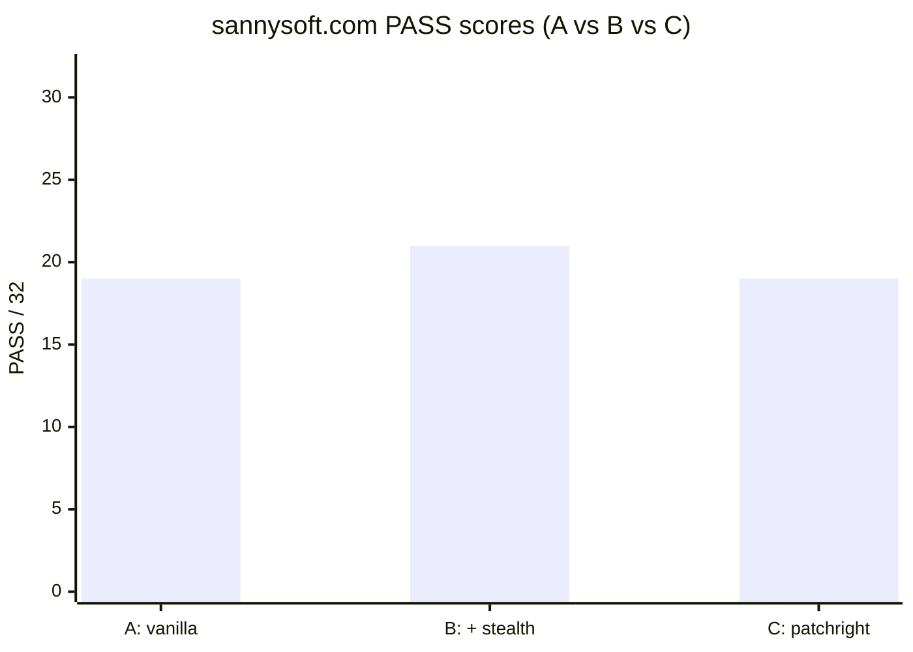
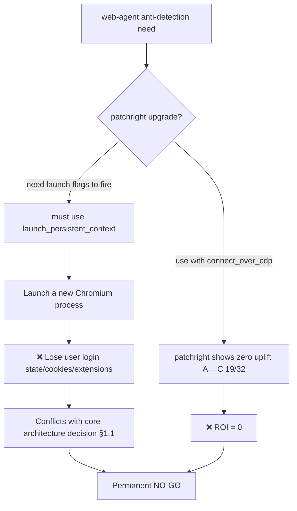
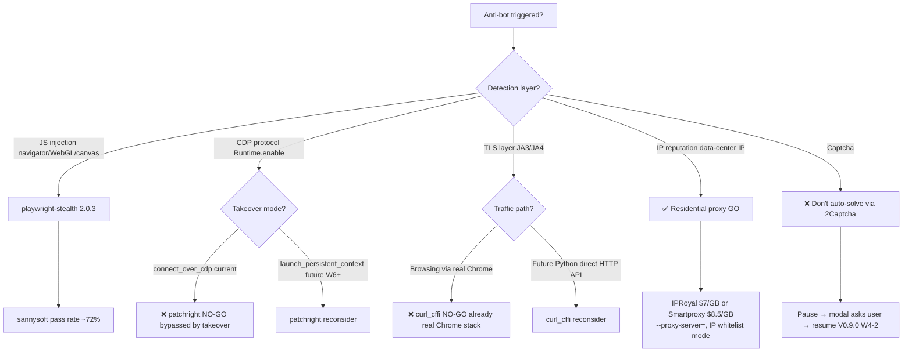

# Why I Permanently NO-GO'd Patchright After a Spike (And the Anti-Detection Decision Tree)

*V0.16.14 anti-detection spike + V0.16.15 curl_cffi decision · 2026-05 · ~7 min read · [English / 中文](2026-05-patchright-nogo-final.md) · by [@franciseliang99-dot](https://github.com/franciseliang99-dot)*


> **TL;DR**: My web-agent runs sannysoft.com anti-detection tests. `vanilla playwright` passes 19/32, with `playwright-stealth` it's 21/32, swap to `patchright` (claimed stronger anti-detection) — still **19/32, identical to vanilla**. The reason isn't that patchright is weak, it's that my web-agent uses `connect_over_cdp` to take over an already-launched Chrome, so **all of patchright's patches sit in the launch phase — completely bypassed**. This is the anti-detection decision tree story: patchright NO-GO / curl_cffi NO-GO / residential proxy GO.

---

## 0. Background: my web-agent's anti-detection needs

[web-agent](https://github.com/franciseliang99-dot/web-agent) is a MultiOn-style Python + Playwright agent that takes over **your already-logged-in Chrome** (via `--remote-debugging-port=9222` + Playwright `connect_over_cdp`). The selling point: keep your cookies / extensions / login state / profile — don't launch a new isolated Chromium.

But taking over a real Chrome also means: **when anti-bot detection fires, your real Chrome gets fingerprinted**. And web-agent runs tasks like:
- Wikipedia search (W1) — no anti-bot
- GitHub / Hacker News data extraction (W2) — light anti-bot
- Gmail compose (W3) — moderate anti-bot
- Cloudflare / DataDome heavily-protected sites — strong anti-bot

So I need an anti-detection layer. Playwright ecosystem offers two candidates: `playwright-stealth` (I'm using 2.0.3) vs `patchright-python` (claimed stronger).

**Question**: does patchright actually deliver any uplift on `connect_over_cdp`? Time to spike.

## 1. The spike: sannysoft.com 3-way comparison

[sannysoft.com](https://sannysoft.com) is the anti-bot benchmark — 35 fingerprint tests (`navigator.webdriver`, `chrome.runtime`, WebGL vendor, canvas fingerprint, etc). PASS / FAIL is straightforward.

3 conditions:

| ID | Config |
|---|---|
| **A** | vanilla playwright + takeover (no stealth, no patch) |
| **B** | vanilla + `apply_stealth(page)` (current production config) |
| **C** | patchright + takeover (replacing the playwright import) |

Each in an isolated worktree, same Chrome on port 9222, same user-data-dir, single-shot screenshot of sannysoft.com.

## 2. Result: **A == C, patchright completely bypassed**

| ID | Config | PASS / score | FAIL |
|---|---|---|---|
| A | vanilla + bare takeover | 19 / 32 (~59%) | 4 |
| B | vanilla + apply_stealth (current) | **21 / 32** (~66%, discounting the WebGL double-fail it's actually 23/32 ~72%) | 2 (WebGL Vendor/Renderer, **environment issue, not anti-bot**) |
| **C** | **patchright + bare takeover** | **19 / 32** (~59%) | 4 |



**A == C, identical**: patchright provides **zero observable uplift** on `connect_over_cdp` 9222 takeover mode.

The 2 extra PASSes B has over A are `HEADCHR_UA` + `CHR_MEMORY` — exactly the head-chr probes stealth is designed to defeat. **patchright doesn't patch this JS injection layer.**

## 3. Root cause: launch phase vs CDP takeover phase

After a subagent dug through patchright source + docs, the picture got clear:

**patchright's core patches mostly live in the launch phase**:
- Modifying launch flags (`--disable-blink-features=AutomationControlled` etc)
- Modifying driver bin (custom Chromium)
- Suppressing `Runtime.enable` CDP probes (commonly used by anti-bot tools at the CDP protocol layer)

**But web-agent takes over an already-launched Chrome** (started by `scripts/start_chrome.sh`, not by Playwright launch) — the entire launch phase is bypassed.

**Meanwhile, sannysoft.com's 35 tests are all in the JS injection layer** (`navigator.*` / WebGL / canvas / `chrome.runtime`). **patchright modifies the CDP protocol layer — sannysoft can't see it**.

Analogy: patchright is "putting an antibacterial mask on the doctor", sannysoft checks "did the doctor wash their hands?". Two different layers.

## 4. Why permanent NO-GO

**patchright requires** `launch_persistent_context` + its custom-modified Chromium for launch flags / Runtime.enable patches to actually fire. To use patchright, I'd have to **abandon** `connect_over_cdp`:



**Core architectural lock-in**: web-agent's selling point is "take over your already-logged-in Chrome", and `launch_persistent_context` would launch a new Chromium = lose that selling point. Until W6+ architecture pivot (a major change), patchright is **permanently NO-GO**.

## 5. Adjacent decision: curl_cffi TLS fingerprint also NO-GO

After the patchright spike, I re-evaluated [curl_cffi](https://github.com/lexiforest/curl_cffi) (a patched BoringSSL TLS library that byte-level forges its ClientHello as real Chrome 145/146). It solves JA3/JA4 TLS fingerprint detection — Cloudflare bot management / DataDome / PerimeterX identify "non-browser" at the TLS layer before HTTP even starts.

But under web-agent's current architecture, curl_cffi is also **ROI = 0**:

| Traffic path | Egress TLS stack | Anti-bot target? | curl_cffi uplift? |
|---|---|---|---|
| Browsing (goto / click / type) | Chrome's own BoringSSL | ✓ (CF/DataDome inspects JA3) | ❌ Already real Chrome fingerprint, curl_cffi can't change it |
| LLM API (anthropic/openai SDK) | Python httpx → OpenSSL | ❌ (API endpoints don't anti-bot) | ❌ Anthropic/OpenAI won't block |

**Core**: all web traffic exits through the real Chrome via `connect_over_cdp` → defaults to real Chrome JA3/JA4. curl_cffi has **zero use** on the browsing path. LLM API calls hit compliant endpoints, no forgery needed.

curl_cffi permanent NO-GO (until W6+ adds "Python direct HTTP path scraping some JSON API", at which point re-evaluate).

## 6. The anti-detection decision tree (V0.16.14-15 logged)

Combining patchright NO-GO + curl_cffi NO-GO + the real next-layer defense (residential proxy) into a tree:



**Key insight**: anti-detection **isn't a single-tool upgrade problem, it's a layered selection problem**. Each layer has different effective tools; pick the wrong layer = ROI=0. My project's core architecture (`connect_over_cdp`) decided which layers are off the menu.

## 7. Lessons

1. **Running a spike beats reading docs**. patchright's docs + benchmarks all said "stronger anti-detection", but **bypassed entirely under my architecture**. 3 worktrees, 1 hour to verify = permanent immunity from "let me try patchright again" recurring uncertainty.

2. **Architecture decisions (§1.1) constrain downstream options**. I picked `connect_over_cdp` to take over real Chrome → automatically excluded patchright + curl_cffi (bypassed / path not needed). It's not a tool problem, it's an architecture problem.

3. **Logging NO-GOs is more valuable than implementing GOs**. Writing "already disproved" paths into ARCHITECTURE.md §1.3 + trigger conditions (only re-evaluate when W6+ architecture pivot) means the next person who picks up this project doesn't waste an hour rerunning the spike.

4. **Anti-detection is a layered model**. JS injection layer (stealth) / CDP protocol layer (patchright) / TLS layer (curl_cffi) / IP reputation layer (residential proxy) — each independent, wrong-layer pick = ROI=0. The decision tree starts with "which layer detected me?" and routes to the appropriate tool.

## 8. Data + code (open source MIT)

Full spike + decision path open-sourced on GitHub:

- 📊 [`docs/ARCHITECTURE.md §1.3`](https://github.com/franciseliang99-dot/web-agent/blob/main/docs/ARCHITECTURE.md) — patchright NO-GO + curl_cffi NO-GO + residential proxy GO complete decision tree
- 📖 [`CHANGELOG.md V0.16.14-15`](https://github.com/franciseliang99-dot/web-agent/blob/main/CHANGELOG.md) — spike measurements + anti-detection decision tree
- 🔧 [`scripts/start_chrome.sh`](https://github.com/franciseliang99-dot/web-agent/blob/main/scripts/start_chrome.sh) — V0.16.14 byproduct: WebGL SwiftShader flags (`--use-gl=angle --use-angle=swiftshader --enable-unsafe-swiftshader`) to make Xvfb mode also pass sannysoft WebGL tests

```bash
# Reproduce the sannysoft spike (3 worktrees, 1 run each)
git clone https://github.com/franciseliang99-dot/web-agent && cd web-agent
uv sync && uv run playwright install chromium
bash scripts/start_chrome.sh https://www.sannysoft.com/  # starts 9222 + opens sannysoft, see scores
```

## Project: web-agent

> MultiOn-style high-fidelity Web Agent. Python + Playwright + VLM/SoM + stealth, BYO LLM (Anthropic/OpenAI/Kimi). Takes over an already-logged-in Chrome, preserving cookies/profile.

- ⭐ **github.com/franciseliang99-dot/web-agent** — MIT License, stars / forks / PRs welcome
- 📋 80+ commits, 255 tests passed, mypy strict 0 errors, GitHub Actions CI all green
- 🤝 [CONTRIBUTING.md](https://github.com/franciseliang99-dot/web-agent/blob/main/CONTRIBUTING.md) — encourages spike/decision logging, same pattern as ARCHITECTURE

If you're evaluating patchright vs playwright-stealth, or about to draw an anti-detection decision tree for your own project, this data might save you 1-2 hours of spike work. If your web automation project also uses `connect_over_cdp` to take over a real Chrome, **directly adopt the NO-GO conclusion** — no need to re-test.

**Comments welcome**: which anti-detection layer have you been bitten by? JS injection / CDP / TLS / IP reputation — which is hardest to defend?

---

*Repost requires source attribution + repo link.*
