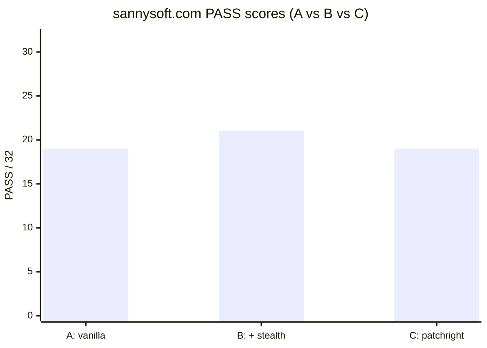
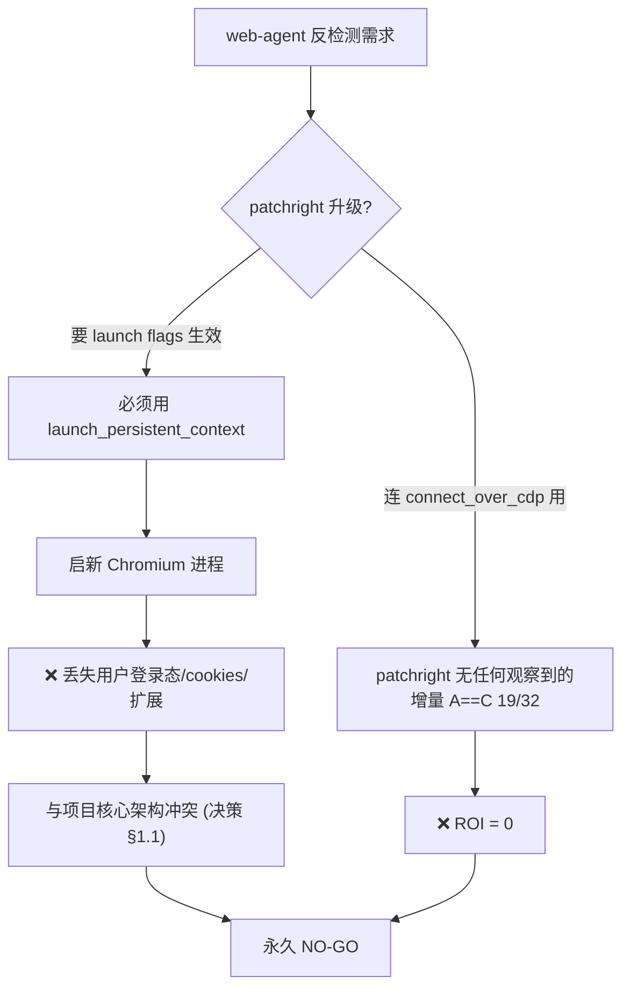
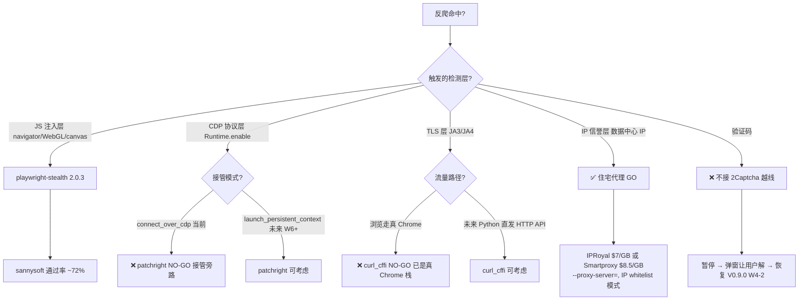

# 为什么我跑了 spike 后把 patchright 永久 NO-GO 了 — 反检测决策树的故事

*V0.16.14 反检测 spike + V0.16.15 curl_cffi 决断 · 2026-05 · 阅读约 7 分钟 · 中文 / [English](2026-05-patchright-nogo-final-en.md) · 作者: [@franciseliang99-dot](https://github.com/franciseliang99-dot)*


> **TL;DR**: 我的 web-agent 跑 sannysoft.com 反检测测试。`vanilla playwright` 19/32 通过, 加 `playwright-stealth` 21/32, 换 `patchright` (号称更强反检测) 仍然 **19/32 — 与 vanilla 完全一样**。原因不是 patchright 不强, 是 web-agent 用 `connect_over_cdp` 接管已启动 Chrome, **patchright 的 patch 全在 launch 阶段 — 完全旁路**。这篇是反检测决策树的故事: patchright NO-GO / curl_cffi NO-GO / 住宅代理 GO。

---

## 0. 背景: 我的 web-agent 反检测需求

[web-agent](https://github.com/franciseliang99-dot/web-agent) 是个 MultiOn 风格的 Python + Playwright agent, 接管你**已登录的 Chrome** (用 `--remote-debugging-port=9222` + Playwright `connect_over_cdp`)。卖点: 保留你的 cookies / 扩展 / 登录态 / profile, 不 launch 隔离 Chromium。

但接管真 Chrome 也意味着: **被反爬侦测时你的真 Chrome 会被识别**. 而 web-agent 跑的任务可能涉及:
- Wikipedia 搜词条 (W1) — 没反爬
- GitHub / Hacker News 提取数据 (W2) — 弱反爬
- Gmail compose (W3) — 中反爬
- Cloudflare / DataDome 重保护站 — 强反爬

需要一层反检测。Playwright 生态有两个候选: `playwright-stealth` (我已用 2.0.3) vs `patchright-python` (号称更强)。

**问题**: patchright 真的能给 `connect_over_cdp` 带来增量吗? 跑 spike 测一下。

## 1. spike 设计 (sannysoft.com 三对照)

[sannysoft.com](https://sannysoft.com) 是反爬测试基准, 35 项指纹检测 (`navigator.webdriver`, `chrome.runtime`, WebGL vendor, canvas fingerprint 等). PASS / FAIL 直观可读。

3 个对照:

| ID | 配置 |
|---|---|
| **A** | vanilla playwright + 接管 (无 stealth, 无 patch) |
| **B** | vanilla + `apply_stealth(page)` (当前生产配置) |
| **C** | patchright + 接管 (替换 playwright import) |

每条 worktree 隔离跑, 同 Chrome 9222 接管, 同 user-data-dir, 跑 sannysoft.com 一次截图。

## 2. 实测数据: **A == C, patchright 完全旁路**

| ID | 配置 | PASS / 计分 | FAIL |
|---|---|---|---|
| A | vanilla + 裸接管 | 19 / 32 (~59%) | 4 |
| B | vanilla + apply_stealth (当前) | **21 / 32** (~66%, 扣 WebGL 双坑实际 23/32 ~72%) | 2 (WebGL Vendor/Renderer, **环境问题非反爬**) |
| **C** | **patchright + 裸接管** | **19 / 32** (~59%) | 4 |



**A == C 完全相同**: patchright 在 `connect_over_cdp` 9222 模式下**没有任何观察到的增量**。

`B` 比 `A` 多的 2 项 PASS 是 `HEADCHR_UA` + `CHR_MEMORY` — 正是 stealth 真正在防的 head-chr 探测。**patchright 没补这层 JS 注入。**

## 3. 根因: launch 阶段 vs CDP 接管阶段

subagent 调研 patchright 源码 + 文档后清楚了:

**patchright 的核心 patch 大部分在 launch 阶段**:
- 改 launch flags (`--disable-blink-features=AutomationControlled` 等)
- 改 driver bin (魔改 Chromium)
- 抑制 `Runtime.enable` CDP 探针 (反爬常用 CDP 协议层 fingerprint)

**web-agent 接管的是用户已启动的 Chrome** (`scripts/start_chrome.sh` 启的, 不是 Playwright launch 的) — launch 阶段全部旁路。

**而 sannysoft.com 的 35 项检测全在 JS 注入层** (`navigator.*` / WebGL / canvas / `chrome.runtime`)。**patchright 改的是 CDP 协议层 — sannysoft 根本看不到**。

类比: patchright 是给"医生戴防菌口罩", sannysoft 检查的是"医生洗手没有"。两个不同层。

## 4. 否决理由

**patchright 要求** `launch_persistent_context` + 它自己魔改的 Chromium 才能让 launch flags / Runtime.enable patch 生效。也就是说要用 patchright, 必须**放弃** `connect_over_cdp`:



**核心架构决定**: web-agent 卖点是"接管已登录 Chrome", launch_persistent_context 启新 Chromium = 失去这个核心卖点。除非未来 W6+ 转架构 (重大变更), 否则 patchright **永久 NO-GO**。

## 5. 关联决策: curl_cffi TLS 指纹 也 NO-GO

跑完 patchright spike 后, 我重新评估 [curl_cffi](https://github.com/lexiforest/curl_cffi) (patched BoringSSL 把 ClientHello 字节级伪装成真 Chrome 145/146 的 TLS 库)。它解决 JA3/JA4 TLS 指纹反爬 — Cloudflare bot management / DataDome / PerimeterX 在 HTTP 之前的 TLS 层识别"非浏览器"。

但 web-agent 当前架构下 curl_cffi 也是 **ROI = 0**:

| 流量路径 | 出口 TLS 栈 | 反爬目标? | curl_cffi 增量? |
|---|---|---|---|
| 浏览 (goto / click / type) | Chrome 自己的 BoringSSL | ✓ (CF/DataDome 看 JA3) | ❌ 已是真 Chrome 指纹, curl_cffi 改不到 |
| LLM API (anthropic/openai SDK) | Python httpx → OpenSSL | ❌ (API 端点不做反爬) | ❌ Anthropic/OpenAI 不会拦 |

**核心**: 所有网页流量从 `connect_over_cdp` 接管的真 Chrome 出去 → 默认就是真 Chrome JA3/JA4。curl_cffi 在浏览路径**完全没用**。LLM API 调用是合规端点, 不需要伪装。

curl_cffi 永久 NO-GO (直到 W6+ 引入"Python 直发 HTTP 旁路抓某 JSON API" 才重评估)。

## 6. 反检测决策树 (V0.16.14-15 落档)

把 patchright + curl_cffi 两个 NO-GO + 真正下一层防御 (住宅代理) 串成决策树:



**关键发现**: 反检测**不是单个工具升级问题, 是分层选择问题**。每层有不同的工具有效, 选错层等于 ROI=0。我的项目核心架构 (`connect_over_cdp`) 决定了哪些层不能选。

## 7. 教训

1. **跑 spike 比读文档可靠**。patchright 文档 + benchmark 都说"更强", 但**在我的架构下旁路**。3 个 worktree 跑 1 小时实证 = 永久免疫"我也试试 patchright 看"的反复纠结。

2. **架构决策 (§1.1) 决定后续选项空间**。我选 `connect_over_cdp` 接管真 Chrome → 自动排除 patchright + curl_cffi (旁路 / 路径不需要)。这不是工具问题, 是架构问题。

3. **NO-GO 落档比 GO 实施更有价值**。把"已证伪"路径写进 ARCHITECTURE.md §1.3 + 触发条件 (W6+ 转架构才重评估), 后人接手不会浪费 1 小时再跑 spike。

4. **反检测是分层模型**。JS 注入层 (stealth) / CDP 协议层 (patchright) / TLS 层 (curl_cffi) / IP 信誉层 (住宅代理) — 每层独立, 选错层 ROI=0。决策树先定位"被哪一层 detect", 再选对应工具。

## 8. 数据 + 代码 (开源 MIT)

完整 spike + 决策路径开源在 GitHub:

- 📊 [`docs/ARCHITECTURE.md §1.3`](https://github.com/franciseliang99-dot/web-agent/blob/main/docs/ARCHITECTURE.md) — patchright NO-GO + curl_cffi NO-GO + 住宅代理 GO 完整决策树
- 📖 [`CHANGELOG.md V0.16.14-15`](https://github.com/franciseliang99-dot/web-agent/blob/main/CHANGELOG.md) — spike 实测数据 + 反检测决策树落档
- 🔧 [`scripts/start_chrome.sh`](https://github.com/franciseliang99-dot/web-agent/blob/main/scripts/start_chrome.sh) — V0.16.14 副产物: WebGL SwiftShader flags (`--use-gl=angle --use-angle=swiftshader --enable-unsafe-swiftshader`) 让 Xvfb 模式也能过 sannysoft WebGL 检测

```bash
# 复现 sannysoft spike (3 worktree 各跑 1 次)
git clone https://github.com/franciseliang99-dot/web-agent && cd web-agent
uv sync && uv run playwright install chromium
bash scripts/start_chrome.sh https://www.sannysoft.com/  # 启 9222 + 直接打 sannysoft 看分数
```

## 项目: web-agent

> MultiOn 风格的高度拟人 Web Agent. Python + Playwright + VLM/SoM + stealth, BYO LLM (Anthropic/OpenAI/Kimi). 接管已登录 Chrome 保留 cookies/profile.

- ⭐ **github.com/franciseliang99-dot/web-agent** — MIT License, 欢迎 star / fork / PR
- 📋 80+ commits, 255 tests passed, mypy strict 0 errors, GitHub Actions CI 全绿
- 🤝 [CONTRIBUTING.md](https://github.com/franciseliang99-dot/web-agent/blob/main/CONTRIBUTING.md) — 鼓励 spike/决策落档习惯, 跟 ARCHITECTURE 同模式

如果你也在评估 patchright vs playwright-stealth, 或者要给反检测路线画决策树, 这个数据可能省你 1-2 小时跑 spike 的时间。如果你的 web 自动化项目和我一样用 `connect_over_cdp` 接管真 Chrome, **直接采纳 NO-GO 结论**, 不必重测。

**评论欢迎讨论**: 你的反检测路线踩过哪一层的坑? JS 注入 / CDP / TLS / IP 信誉 — 哪个最难?

---

*转载请注明来源 + repo 链接.*
