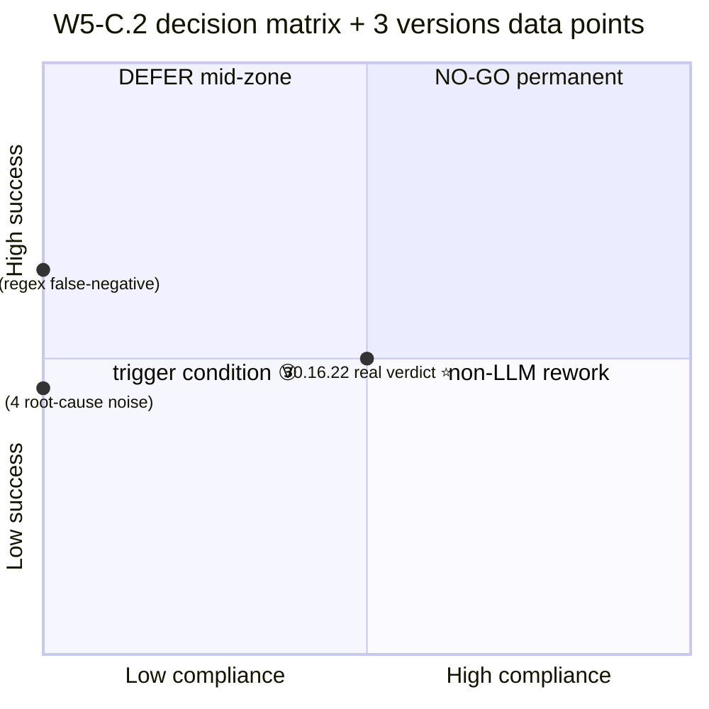
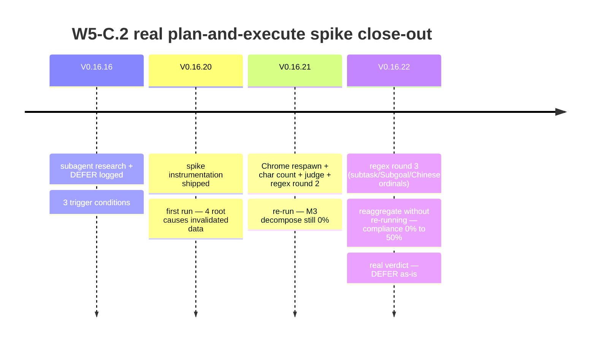

# 50% Compliance, Not 0%: How a Logging Spike Almost Triggered the Wrong Architecture Rewrite

*W5-C.2 spike close-out · 2026-05 · ~8 min read · [English / 中文](2026-05-w5c2-spike-story-final.md) · by [@franciseliang99-dot](https://github.com/franciseliang99-dot)*


> **TL;DR**: I thought my prompt augmentation track was **completely broken** (compliance=0%) and almost spent 27 hours rewriting the entire plan-and-execute architecture. Turns out the 0% was a **regex bug in the measurement tooling** — the real value was 50%. This is a story about: spike-running being harder than it looks, Chrome GPU deadlocks, and "be careful when reading your own logs" — excerpted from a 7-version close-out cycle in my open-source web-agent project.

---

## 0. Background: plan-and-execute vs prompt augmentation

I'm building a [MultiOn-style web agent](https://github.com/franciseliang99-dot/web-agent) — Python + Playwright + Claude vision taking over an already-logged-in Chrome. When a task arrives, should the agent "decompose subgoals first, then execute" or "ReAct one step at a time"?

**Two tracks**:

| Approach | Implementation | SDK compatibility | Effort |
|---|---|---|---|
| **W5-C real plan-and-execute** | First step calls LLM `plan()` for a subgoal list, then executes | Anthropic ✅ / OpenAI ❌ / Kimi ❌ (vision model needs ≥1 image) | ~27h |
| **W5-C prompt augmentation (V0.15.0, chosen)** | No LLM call — just inject a hint into trace: "If task is complex, decompose into 3-6 subgoals in your `thought` before executing" | All three providers | <1h |

augmentation is a nudge, not a constraint — the LLM decides whether to decompose. The Anthropic-only-MVP version of real plan-and-execute conflicts with the project's "BYO LLM" selling point. So in V0.16.16 I logged **DEFER + 3 trigger conditions**:

1. User feedback citing real cases of "augmentation didn't decompose, task failed"
2. OpenAI/Kimi officially supporting zero-image calls
3. **Pre-spike data showing plan-and-execute failure rate is >20% lower than augmentation**

To trigger ③, I needed to first quantify **the current state**: under the augmentation track, does the LLM actually decompose subgoals in `thought`? How well?

—Alright, let me run a spike.

## 1. V0.16.20: tooling shipped + first run

I designed 5 machine-checkable metrics:

| ID | Name | Granularity | Detection |
|---|---|---|---|
| **M1** | subgoal_marker_present | per step | thought contains "子目标 / 步骤 N / first / step N" etc |
| **M2** | plan_referenced | per step | thought references the overall plan ("currently at step 2" etc) |
| **M3** | task_has_plan | per task | M1 fires in any of the first 3 steps ("did it plan at start") |
| **M4** | plan_consistency | per task | M2 fire count ≥ ⌈n/3⌉ ("did it stick to the plan") |
| **M5** | revision_on_failure | per failed step | thought after a failed step contains "switch strategy" etc |

Add a 20-task list (6 long tasks ≥200 chars triggering augmentation hint + 14 short tasks), write the decision matrix:

| compliance (M3 ∧ M4) | task success | verdict |
|---|---|---|
| ≥80% | ≥70% | augmentation already enough → **permanent NO-GO** |
| 30-80% | 50-70% | **DEFER as-is** |
| <30% | <50% | **trigger condition ③ candidate** (run plan-and-execute comparison spike) |
| ≥30% | <30% | non-LLM rework (SoM/actuator issues) |



Ran 80 minutes, data came back:

```
total tasks: 20  steps logged: 74  should_decompose tasks: 2
task success rate: 9/20 = 45%
M3 task_has_plan (per task): all=20%  decompose=0%
compliance (M3 ∧ M4): all=0%  decompose=0%
```

**M3 decompose=0% / compliance=0%** + success<50% — literally lands in "trigger ③ candidate". Right before I was about to commit to the 27h plan-and-execute comparison spike, I habitually flipped through the raw jsonl data.

—Houston, we have a problem.

## 2. V0.16.20 data was actually noise (4 root causes)

| # | Issue | Evidence |
|---|---|---|
| 1 | **Chrome dies after 9 tasks** | label 14-20 all show `SCRIPT_ERROR: TimeoutError: Page.screenshot: Timeout 30000ms`, **only 13/20 tasks actually ran** |
| 2 | **Char count miscalculation** | 4 of 6 designed long tasks were actually 166-189 chars < 200 threshold — augmentation real test set was **n=1** |
| 3 | **task 04 false success** | result=`LOOP_DETECTED at step 16` but `expect` contained "Dutch" → `_judge()` matched. Stuck for 16 steps got counted as success |
| 4 | **M2 regex false negative** | task 04 thoughts used "第一步/第二步/第三步" (Chinese ordinals), missed by M2 |

The data was all noise. Decision matrix unusable.

## 3. V0.16.21: 4 root-cause fixes

The deepest one was #1 — Chrome dying after 9 tasks. Plan subagent diagnosis:

> **GPU SwiftShader process hangs in font/paint pipeline**. After duckduckgo.com triggers some dynamic font or canvas operation, the GPU process deadlocks but doesn't crash — every subsequent page screenshot stalls after "fonts loaded" waiting for GPU compositing.
>
> Key finding: **CDP shares the GPU process**. Under Playwright `connect_over_cdp` mode, closing a browser doesn't kill the Chrome main process; the GPU process stays stuck. L2 close+reconnect defense is **ineffective** — must kill at process level.

Fixes:
- **L1 retry**: SCRIPT_ERROR Timeout → kill+respawn Chrome + retry once
- **L3 periodic restart**: every 5 tasks, proactive kill+respawn (~15s overhead)
- **char count**: pad 4 long-task goals to ≥220 chars
- **judge**: FAILURE_MARKERS short-circuit to prevent false success
- **regex**: M1 added `第\s*[一二三四五六七八九十0-9]+\s*步` (Chinese ordinals)

Re-run:

```
total tasks: 20  steps logged: 112  should_decompose tasks: 6
task success rate: 13/20 = 65%
M3 decompose=0%  M4 decompose=0%  compliance decompose=0%
```

success 45% → **65%**, should_decompose 2 → **6**, but **M3 decompose still 0%**.

I thought augmentation really wasn't working. Almost ready to log V0.16.22 as triggering condition ③.

## 4. V0.16.22: the key insight — measurement layer, not LLM, was failing

I had a subagent sample the jsonl thought texts from the 6 long tasks. Result:

The LLM was using **3 different** subgoal expressions:

| LLM actual expression | V0.16.21 regex match? | Source |
|---|---|---|
| **"子任务 1 / 子任务 2 / ..."** ("subtask 1, 2, ...") | ❌ Missed | Tasks 18/20 directly echoing prompt wording, 10 instances |
| **"Subgoal:"** | ❌ Missed | Task 15 template response (English bare word) |
| **"第 N 步"** ("step N", Chinese ordinal) | ✅ V0.16.21 already fixed | Task 04 (got stuck so used rarely) |

**M3=0% wasn't the LLM failing to decompose — my regex only matched 1 of 3 expressions.**

I added two alternatives to M1: `子任务\s*[一二三四五六七八九十0-9]+|\bsubgoal\b`. M2 got `Subgoal:` / `已完成子任务` / `currently working on subgoal` etc.

But **the most critical optimization** was not re-running the spike: thought texts were already stored in jsonl files, I just needed to re-evaluate M1/M2/M5 with the new regex and re-emit summary. Wrote `scripts/reaggregate_w5c2.py` in 75 lines:

```python
def main() -> int:
    # Step 1: back up V0.16.21 raw jsonl for audit trail
    if not BACKUP_DIR.exists():
        shutil.copytree(OUT_DIR, BACKUP_DIR)

    for jp in OUT_DIR.glob("*.jsonl"):
        rows = [json.loads(ln) for ln in jp.read_text().splitlines()]
        rows = [_recompute(r) for r in rows]  # re-judge with new regex
        with jp.open("w") as f:
            for r in rows:
                f.write(json.dumps(r, ensure_ascii=False) + "\n")

    print_summary()  # reuse run_w5c2_spike.print_summary
```

**Saved 80 minutes of re-running + 4 Chrome respawns**. Within 30 seconds, the data came back:

| Metric | V0.16.21 | V0.16.22 (reaggregate) | Δ |
|---|---|---|---|
| M1 per step | 9% | **32%** | +23pp |
| M2 per step | 0% | **25%** | +25pp |
| **M3 decompose** | 0% | **50%** | +50pp |
| **M4 decompose** | 0% | **50%** | +50pp |
| **compliance decompose** | 0% | **50%** | +50pp |

**augmentation has 50% compliance on long tasks** — not 0%.

## 5. Real verdict + lessons

decompose subset (n=6, augmentation's actual target group):
- compliance 50% ∈ 30-80% ✓
- success 50% ∈ 50-70% ✓
- → Lands in matrix **#2: DEFER as-is**

**Don't launch W5-C.2 plan-and-execute comparison spike (~3h)**:
- augmentation makes 50% of long tasks decompose at start + 50% follow plan after
- plan-and-execute improvement headroom ≤ 50%, current success 50% is already OK
- Trigger condition ③ loses motivation

**27 hours saved**.

### Lessons

1. **When measurement tools have bugs, every decision matrix is wrong**. M3=0% looked like LLM failure + augmentation design failure, but was actually a regex false negative. Spot check raw data first before drawing conclusions.

2. **Spike runs are harder than they look**. Chrome GPU SwiftShader deadlock, user-data-dir accumulation, CDP-shared GPU process can't close+reconnect — pitfalls I never imagined.

3. **regex matching LLM real expressions is an engineering problem**. I designed prompts using "子任务 N" (Chinese), so the LLM mostly echoed those words — but my regex only had "子目标" and "first I". Before running a spike, simulate 1 task and spot check whether your regex catches actual LLM output.

4. **Re-aggregating without re-running is the 80-minute trick**. Storing thought texts in jsonl makes regex calibration offline — this design wasn't planned in V0.16.20 but emerged organically in V0.16.22. Next time I design a spike tool, raw thought storage is mandatory.

## 6. The 7-version close-out



The augmentation track now has a 50% compliance data baseline. Trigger condition ③ loses motivation; trigger condition ① (user feedback) remains a future trigger.

## 7. Data + code (open source MIT)

The full 7-version close-out + decision path is open-sourced on GitHub:

- 📊 [`CHANGELOG.md V0.16.16-22`](https://github.com/franciseliang99-dot/web-agent/blob/main/CHANGELOG.md) — per-version data + decision derivation
- 📖 [`docs/ARCHITECTURE.md §1.5`](https://github.com/franciseliang99-dot/web-agent/blob/main/docs/ARCHITECTURE.md) — DEFER logging + trigger conditions + real verdict
- 🔧 [`scripts/run_w5c2_spike.py`](https://github.com/franciseliang99-dot/web-agent/blob/main/scripts/run_w5c2_spike.py) (run, 280 lines) + [`scripts/reaggregate_w5c2.py`](https://github.com/franciseliang99-dot/web-agent/blob/main/scripts/reaggregate_w5c2.py) (re-aggregate, 75 lines)
- 🧪 [`tests/test_loop_spike_w5c2.py`](https://github.com/franciseliang99-dot/web-agent/blob/main/tests/test_loop_spike_w5c2.py) — 10 cases verifying regex + jsonl schema

```bash
# Reproduce the spike (requires ANTHROPIC_API_KEY + Chrome)
git clone https://github.com/franciseliang99-dot/web-agent && cd web-agent
uv sync && uv run playwright install chromium
cp .env.example .env  # fill in ANTHROPIC_API_KEY
WEB_AGENT_SPIKE_W5C2=1 uv run python scripts/run_w5c2_spike.py

# Later: change regex / add tasks → no need to re-run spike
uv run python scripts/reaggregate_w5c2.py
```

## Project: web-agent

> MultiOn-style high-fidelity Web Agent. Python + Playwright + VLM/SoM + stealth, BYO LLM (Anthropic/OpenAI/Kimi). Takes over an already-logged-in Chrome, preserving cookies/profile.

- ⭐ **github.com/franciseliang99-dot/web-agent** — MIT License, stars / forks / PRs welcome
- 📋 80+ commits, 255 tests passed, mypy strict 0 errors, GitHub Actions CI all green
- 🤝 [CONTRIBUTING.md](https://github.com/franciseliang99-dot/web-agent/blob/main/CONTRIBUTING.md) — encourages spike/decision logging, same pattern as ARCHITECTURE

If you're choosing between plan-and-execute vs prompt augmentation, or about to write a decision matrix for an LLM track, this data might save you 27 hours. If you hit similar Chrome GPU SwiftShader deadlock issues, see the 4-root-cause diagnosis section in [V0.16.21 CHANGELOG](https://github.com/franciseliang99-dot/web-agent/blob/main/CHANGELOG.md).

**Comments welcome**: How does your spike workflow avoid similar measurement-layer false negatives? regex / LLM-as-judge / human-in-the-loop — how do you trade off?

---

*Repost requires source attribution + repo link. Cross-posted on dev.to / Zhihu / Hacker News.*
