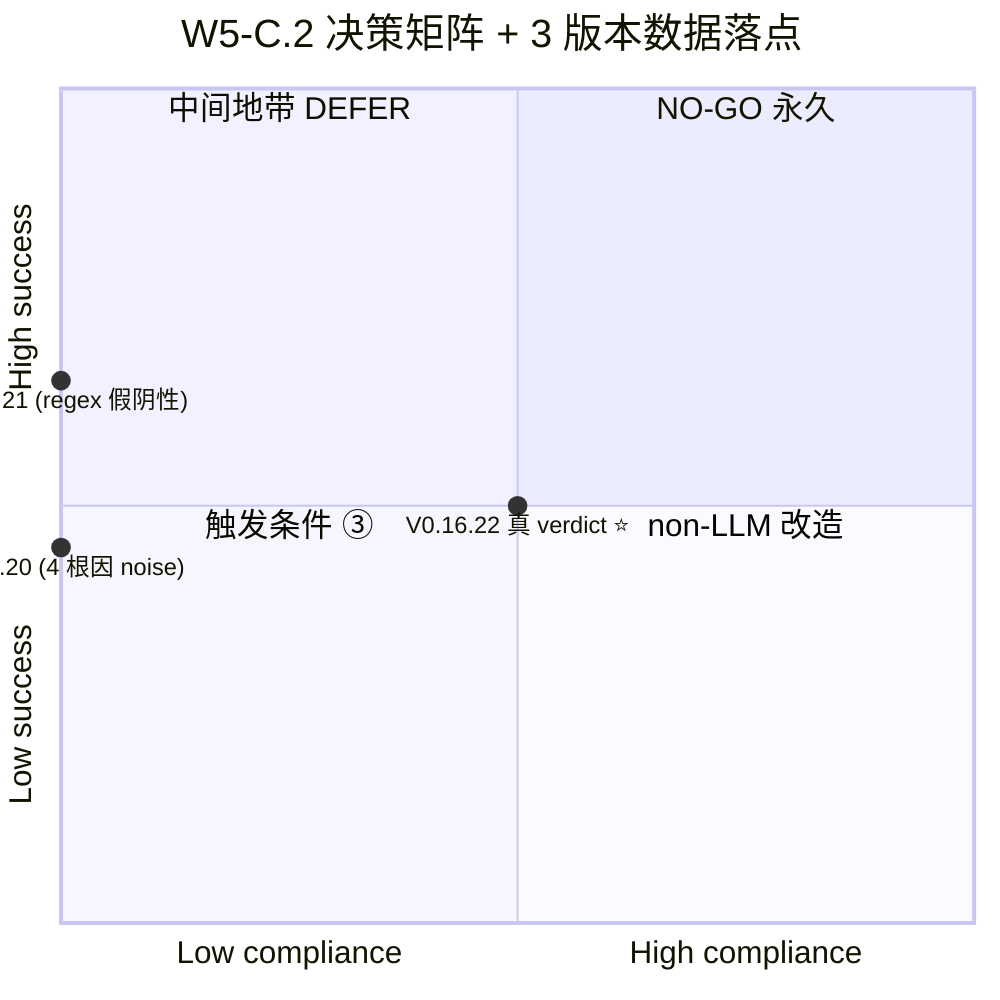
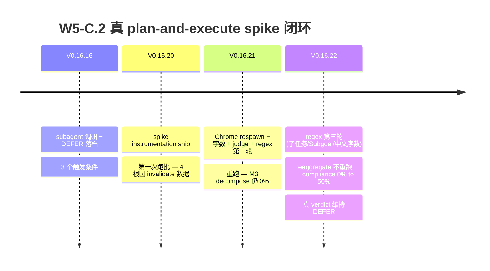

# 我差点重写整个规划层 — 一个 regex 假阴性的故事

*W5-C.2 spike 闭环 · 2026-05 · 阅读约 8 分钟 · 中文 / [English](2026-05-w5c2-spike-story-final-en.md) · 作者: [@franciseliang99-dot](https://github.com/franciseliang99-dot)*


> **TL;DR**：我以为我的 prompt augmentation 路线**完全无效**（compliance=0%），差点立项 27 小时去重写整个 plan-and-execute 架构。最后发现 0% 是**测量工具的 regex bug**，真值是 50%。这是关于 spike 跑批怎么踩 4 个坑、Chrome GPU 死锁的诡异、和"读你自己的日志要很小心"的故事——开源 web-agent 项目 7 版本闭环节选。

---

## 0. 背景：plan-and-execute vs prompt augmentation

我在做一个 [MultiOn 风格的 web agent](https://github.com/franciseliang99-dot/web-agent) — Python + Playwright + Claude vision 接管已登录 Chrome。任务来了之后，agent 需要"先拆 subgoal 再执行"还是"直接 ReAct 一步步来"？

**两条路线**:

| 方案 | 实现 | SDK 兼容 | 工时 |
|---|---|---|---|
| **W5-C 真 plan-and-execute** | 第一步真调 LLM `plan()` 拿 subgoal 列表再执行 | Anthropic ✅ / OpenAI ❌ / Kimi ❌ (vision model 必须 ≥1 image) | ~27h |
| **W5-C prompt augmentation (V0.15.0 已选)** | 不调 LLM，只在 trace 注入 hint："如果任务复杂，请在 thought 里把任务拆 3-6 个 subgoal 再执行" | 三 provider 通用 | <1h |

augmentation 是 nudge 不是约束 — LLM 自己决定要不要拆。Anthropic-only MVP 的真 plan-and-execute 与"BYO LLM"项目卖点冲突，所以 V0.16.16 我落档 **DEFER + 3 个触发条件**:

1. 用户反馈多个"augmentation 没拆 task 导致失败"的真实案例
2. OpenAI/Kimi 官方支持零 image 调用
3. **前置 spike 数据证 plan-and-execute 失败率比 augmentation 低 >20%**

要触发 ③，需要先量化**现状**：当前 augmentation 路线下，LLM 是否真在 thought 拆 subgoal？拆得好不好？

——好，跑个 spike。

## 1. V0.16.20: 工具 ship + 第一次跑批

我设计 5 个机器可判定指标：

| ID | 名称 | 粒度 | 判定 |
|---|---|---|---|
| **M1** | subgoal_marker_present | per step | thought 含 "子目标 / 步骤 N / first / step N" 等 |
| **M2** | plan_referenced | per step | thought 引用整体 plan ("当前在第 2 步" 等) |
| **M3** | task_has_plan | per task | 前 3 步任意一步 M1=True ("开局有没有拆") |
| **M4** | plan_consistency | per task | M2 命中步数 ≥ ⌈n/3⌉ ("拆了之后跟着走没") |
| **M5** | revision_on_failure | per failed step | 失败步下一步 thought 含"换策略" 等 |

加 20 个任务的清单（6 个 ≥200 字长任务触发 augmentation hint + 14 个短任务），写决策矩阵：

| compliance (M3 ∧ M4) | task success | verdict |
|---|---|---|
| ≥80% | ≥70% | augmentation 已够用 → **永久 NO-GO** |
| 30-80% | 50-70% | **维持 DEFER** |
| <30% | <50% | **触发条件 ③ 候选** (跑 plan-and-execute 对照 spike) |
| ≥30% | <30% | non-LLM 改造 (SoM/actuator 问题) |



跑 80 分钟，数据回来：

```
total tasks: 20  steps logged: 74  should_decompose tasks: 2
task success rate: 9/20 = 45%
M3 task_has_plan (per task): all=20%  decompose=0%
compliance (M3∧M4): all=0%  decompose=0%
```

**M3 decompose=0% / compliance=0%** + success<50% — 字面落"触发条件 ③ 候选"。我快要立项 27h plan-and-execute 对照 spike 的时候，习惯性翻了下 jsonl 原始数据。

——出问题了。

## 2. V0.16.20 数据其实是噪音（4 根因）

| # | 问题 | 证据 |
|---|---|---|
| 1 | **Chrome 9 任务后挂死** | label 14-20 全 `SCRIPT_ERROR: TimeoutError: Page.screenshot: Timeout 30000ms`，**实际只跑了 13/20 个有效任务** |
| 2 | **设计字数估错** | 我设计的 6 个长任务里 4 个实际 166-189 字 < 200 阈值，augmentation 真实测试 **n=1** |
| 3 | **task 04 false success** | result=`LOOP_DETECTED 在 step 16` 但 expect 含 "Dutch" → `_judge()` 命中。stuck 16 步算成 success |
| 4 | **M2 regex 假阴性** | task 04 thought 用了"第一步/第二步/第三步" (中文序数)，被 M2 漏判 |

数据全是噪音，决策矩阵不能用。

## 3. V0.16.21: 4 根因修复

最深的根因是 #1 — Chrome 跑 9 任务后挂死。Plan subagent 诊断:

> **GPU SwiftShader 进程 hang on font/paint pipeline**. duckduckgo.com 触发某个动态字体或 canvas 操作后, GPU 进程死锁但未崩溃 — 后续每个新页面 screenshot 都卡在 "fonts loaded" 之后等 GPU compositing.
>
> 关键发现：**CDP 共享 GPU 进程**。Playwright `connect_over_cdp` 模式下 close browser 不杀 Chrome 主进程，GPU 进程仍卡。L2 close+reconnect 防御**无效** — 必须 kill 进程级重启。

修复:
- L1 retry: SCRIPT_ERROR Timeout → kill+respawn Chrome + retry 1 次
- L3 周期重启: 每 5 任务主动 kill+respawn (~15s overhead)
- 字数: 4 个长任务 goal 拼到 ≥220 字
- judge: FAILURE_MARKERS 短路防 false success
- regex: M1 加 `第\s*[一二三四五六七八九十0-9]+\s*步` (中文序数)

重跑：

```
total tasks: 20  steps logged: 112  should_decompose tasks: 6
task success rate: 13/20 = 65%
M3 decompose=0%  M4 decompose=0%  compliance decompose=0%
```

success 从 45% → **65%**, should_decompose 2 → **6**, 但 **M3 decompose 还是 0%**。

我以为 augmentation 真没工作。差点准备 V0.16.22 触发条件 ③ 立项。

## 4. V0.16.22: 关键发现 — 测量层而非 LLM 失败

我让 subagent 抽样 6 个长任务的 jsonl thought 原文。结果:

LLM 用了 **3 种** subgoal 表达：

| LLM 实际表达 | V0.16.21 regex 命中? | 来源 |
|---|---|---|
| **"子任务 1 / 子任务 2 / ..."** | ❌ 漏 | label 18/20 直接复述 prompt 字样，实测 10 次 |
| **"Subgoal:"** | ❌ 漏 | label 15 模板回应 (英文裸词) |
| **"第 N 步"** (中文序数) | ✅ V0.16.21 已修 | label 04 (但 stuck 用得少) |

**M3=0% 不是 LLM 没拆 plan, 是我的 regex 只命中 1/3 种表达。**

我加两条 alternative 到 M1: `子任务\s*[一二三四五六七八九十0-9]+|\bsubgoal\b`，M2 同步加 `Subgoal:` / `已完成子任务` / `currently working on subgoal` 等。

但**最关键的优化**是不重跑 spike：原 jsonl 文件里 thought 字段已存，我只需用新 regex 重判 M1/M2/M5 + 重出 summary。写 `scripts/reaggregate_w5c2.py` 75 行：

```python
def main() -> int:
    # 第一步: 备份 V0.16.21 原始 jsonl 保 audit trail
    if not BACKUP_DIR.exists():
        shutil.copytree(OUT_DIR, BACKUP_DIR)

    for jp in OUT_DIR.glob("*.jsonl"):
        rows = [json.loads(ln) for ln in jp.read_text().splitlines()]
        rows = [_recompute(r) for r in rows]  # 用新 regex 重判
        with jp.open("w") as f:
            for r in rows:
                f.write(json.dumps(r, ensure_ascii=False) + "\n")

    print_summary()  # 复用 run_w5c2_spike.print_summary
```

**省掉 80 分钟重跑 + Chrome respawn 4 次**。在 30 秒内，数据回来：

| 指标 | V0.16.21 | V0.16.22 (reaggregate) | Δ |
|---|---|---|---|
| M1 per step | 9% | **32%** | +23pp |
| M2 per step | 0% | **25%** | +25pp |
| **M3 decompose** | 0% | **50%** | +50pp |
| **M4 decompose** | 0% | **50%** | +50pp |
| **compliance decompose** | 0% | **50%** | +50pp |

**augmentation 在长任务上有 50% compliance**，不是 0%。

## 5. 真 verdict + 教训

decompose subset (n=6, augmentation 实际目标群):
- compliance 50% ∈ 30-80% ✓
- success 50% ∈ 50-70% ✓
- → 落矩阵 **#2: 维持 DEFER**

**不立项 W5-C.2 plan-and-execute 对照 spike (~3h)**:
- augmentation 能让 50% 长任务在前 3 步开局拆 plan + 50% 后续 follow plan
- plan-and-execute 改进空间 ≤ 50%, 当前 success 50% 已 OK 水平
- 触发条件 ③ 失去 motivation

**节省 27 小时**。

### 教训

1. **测量工具有 bug 时, 任何决策矩阵都是错的**。M3=0% 看起来是 LLM 失败 + augmentation 设计错，实际是 regex 假阴性。先 spot check 几个原始数据再下结论。

2. **spike 跑批比想像中复杂**。Chrome GPU SwiftShader 死锁、user-data-dir 累积、CDP 共享 GPU 进程不能 close+reconnect — 这些坑没踩过想不到。

3. **regex 命中 LLM 实际表达是工程问题**。我设计 prompt 用"子任务 N"中文，LLM 大概率复述这个词，但我 regex 只准备了"子目标"和"first I"。开 spike 前先模拟 1 个任务跑一下 spot check regex 设计能命中实际输出。

4. **不重跑只重处理 jsonl 是省 80 分钟的关键 trick**。把 thought 原文存到 jsonl，让 regex 校准可以离线 re-aggregate — 这个设计在 V0.16.20 我没规划但 V0.16.22 自然涌现。下次设计 spike 工具时 thought 原文必须存。

## 6. 7 版本闭环



augmentation 路线获得 50% compliance 数据底座, plan-and-execute 立项 motivation 显著降低. 触发条件 ③ 失去 motivation, 触发条件 ① (用户反馈) 仍是未来 trigger.

## 7. 数据 + 代码 (开源 MIT)

全部 7 版本闭环 + 决策路径开源在 GitHub:

- 📊 [`CHANGELOG.md V0.16.16-22`](https://github.com/franciseliang99-dot/web-agent/blob/main/CHANGELOG.md) — 每版本数据 + 决策推演
- 📖 [`docs/ARCHITECTURE.md §1.5`](https://github.com/franciseliang99-dot/web-agent/blob/main/docs/ARCHITECTURE.md) — DEFER 落档 + 触发条件 + 真 verdict
- 🔧 [`scripts/run_w5c2_spike.py`](https://github.com/franciseliang99-dot/web-agent/blob/main/scripts/run_w5c2_spike.py) (跑批 280 行) + [`scripts/reaggregate_w5c2.py`](https://github.com/franciseliang99-dot/web-agent/blob/main/scripts/reaggregate_w5c2.py) (重处理 75 行)
- 🧪 [`tests/test_loop_spike_w5c2.py`](https://github.com/franciseliang99-dot/web-agent/blob/main/tests/test_loop_spike_w5c2.py) — 10 case 验证 regex + jsonl schema

```bash
# 复现 spike 跑批 (要 ANTHROPIC_API_KEY + Chrome)
git clone https://github.com/franciseliang99-dot/web-agent && cd web-agent
uv sync && uv run playwright install chromium
cp .env.example .env  # 填 ANTHROPIC_API_KEY
WEB_AGENT_SPIKE_W5C2=1 uv run python scripts/run_w5c2_spike.py

# 之后改 regex / 加任务 → 不必重跑
uv run python scripts/reaggregate_w5c2.py
```

## 项目: web-agent

> MultiOn 风格的高度拟人 Web Agent. Python + Playwright + VLM/SoM + stealth, BYO LLM (Anthropic/OpenAI/Kimi). 接管已登录 Chrome 保留 cookies/profile.

- ⭐ **github.com/franciseliang99-dot/web-agent** — MIT License, 欢迎 star / fork / PR
- 📋 80+ commits, 255 tests passed, mypy strict 0 errors, GitHub Actions CI 全绿
- 🤝 [CONTRIBUTING.md](https://github.com/franciseliang99-dot/web-agent/blob/main/CONTRIBUTING.md) — 鼓励 spike/决策落档习惯, 跟 ARCHITECTURE 同模式

如果你也在做 plan-and-execute vs prompt augmentation 选型, 或者要给 LLM 工程路线写决策矩阵, 这个数据可能省你 27 小时。如果踩到类似 Chrome GPU SwiftShader 死锁的坑, 看 [V0.16.21 CHANGELOG](https://github.com/franciseliang99-dot/web-agent/blob/main/CHANGELOG.md) 的 4 根因诊断章节。

**评论欢迎讨论**: 你的 spike 流程怎么避免类似的测量层假阴性? regex / LLM-as-judge / human-in-the-loop, 怎么 trade-off?

---

*转载请注明来源 + repo 链接. 同步发布于 dev.to / 知乎 / Hacker News.*
- [ ] 评论区准备答案:
  - "为什么用 Anthropic 不用 OpenAI" → vision model 兼容性 + prompt caching
  - "patchright 真不能用吗" → V0.16.14 spike NO-GO，与 connect_over_cdp 接管模式冲突
  - "为什么不直接 plan-and-execute" → 本文核心论点 + ARCHITECTURE §1.5
